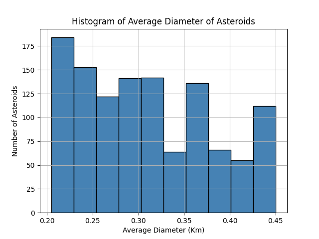

# ☄️ NASA Asteroid Data Analysis

A Python project for analyzing and visualizing asteroid data provided by NASA. This assignment was completed as part of the "Programming and Data Analysis in Python" course at the Open University of Israel.

---

## 🧠 Project Overview

The project loads and cleans asteroid data from a CSV file (`nasa.csv`) and performs statistical analysis and data visualizations, including:

- Filtering data based on date and orbit info
- Calculating max/min diameters
- Identifying hazardous asteroids
- Graphing histograms and pie charts for insights

---

## 🧩 Features

- ✅ Data loading and validation using `numpy`
- ✅ Masking data after year 2000
- ✅ Filtering and displaying selected columns (e.g., Neo Reference ID, Equinox, Orbiting Body)
- ✅ Statistical analysis functions:
  - Largest absolute magnitude
  - Closest asteroid to Earth
  - Common orbits
  - Diameter statistics
- ✅ Visualizations using `matplotlib`:
  - Histogram of asteroid diameters
  - Histogram of orbit distribution
  - Pie chart of hazardous vs non-hazardous
  - Linear regression: magnitude vs velocity

---

## 📊 Sample Output

Here’s an example of a histogram generated by the project:



> Additional visualizations:
> - Orbit intersection histogram
> - Pie chart of hazardous vs non-hazardous asteroids
> - Linear regression: absolute magnitude vs velocity  
> See all visualizations in the `plots/` folder.

---

## ⚙️ How to Run

1. Clone this repository  
2. Ensure `nasa.csv` is in the same directory  
3. Run:

```bash
python nasa_asteroid_ds.py
```

---

## 📁 File Structure

```
nasa_asteroid_ds.py     # Main project script
nasa.csv                # Asteroid dataset
plots/                  # Output visualizations
README.md               # Project documentation
```

---

## 📚 Lessons Learned

- Practiced NumPy data manipulation
- Applied Matplotlib for visual storytelling
- Strengthened Python function design and error handling

---

## ✍️ Author

- Amir Kot  
- [GitHub Profile](https://github.com/AmirKot)

---

## 🎓 Course Info

> Programming and Data Analysis in Python – 20606  
> The Open University of Israel (2024B Semester)
